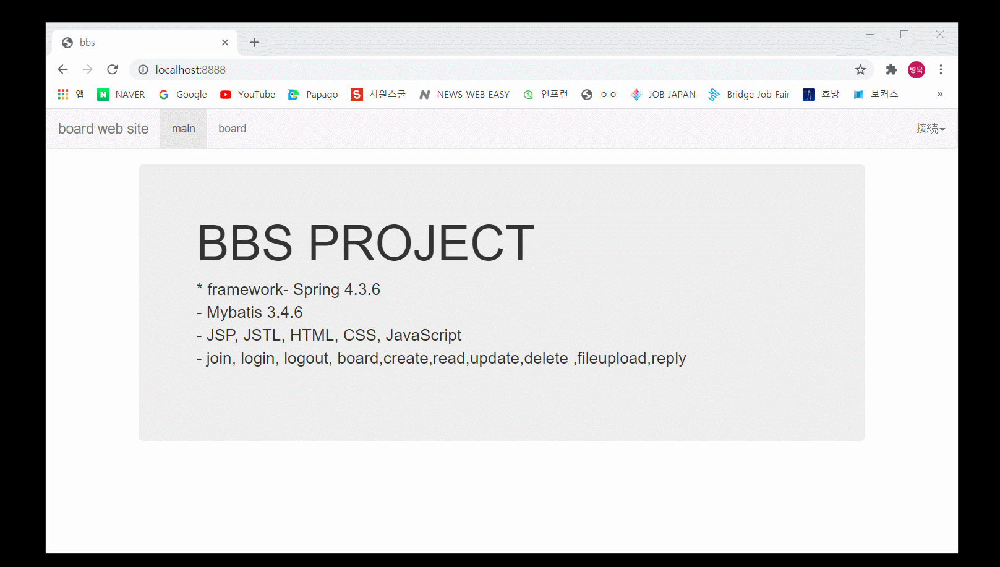
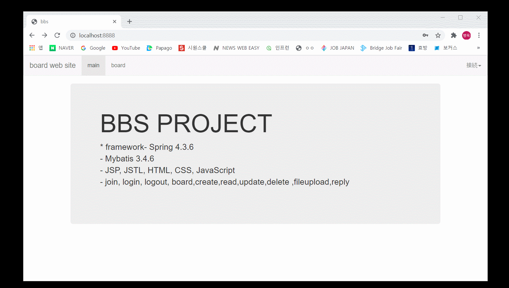
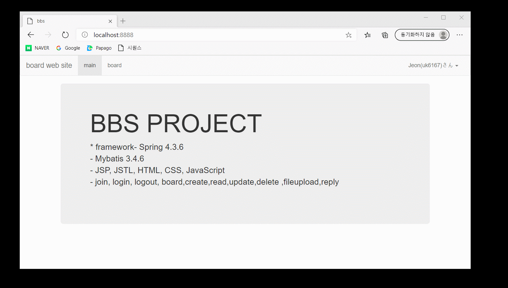
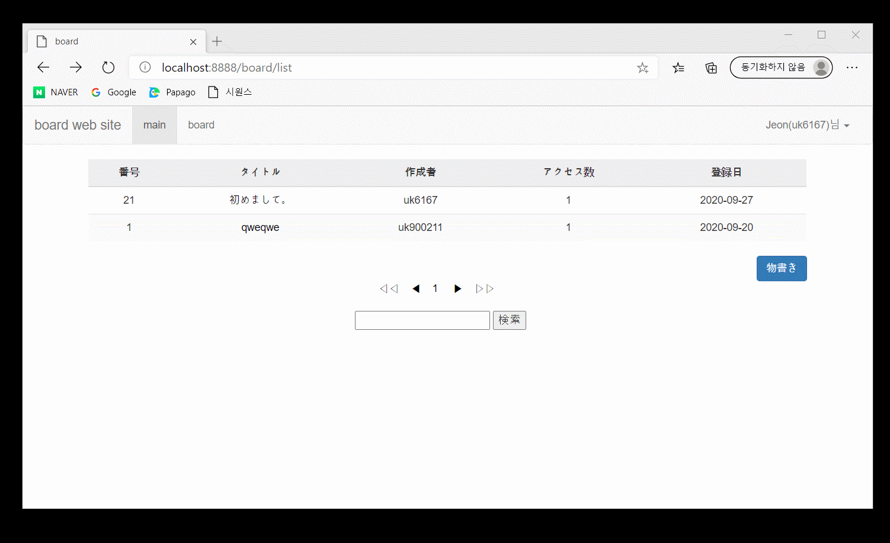
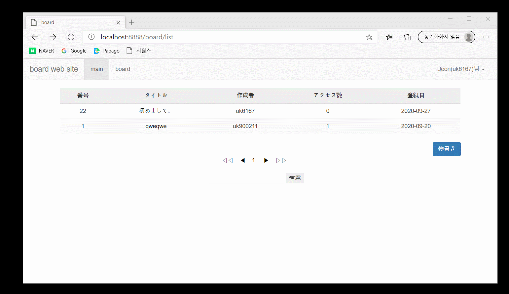
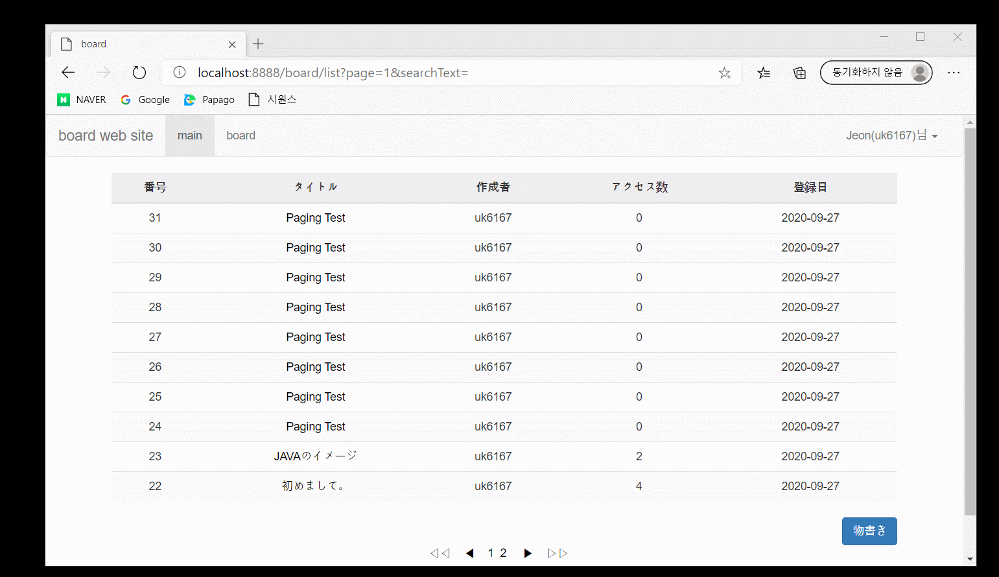

# 返信掲示板システム
## 製作動機
- どのようなwebでもboardは必ず必要です。
- 新入開発者の基本だと思います。
- 早くboardを作ることを目標に練習を重ねて完成したプロジェクトです。

## プロジェクト要求事項

- boardのwebsiteには、userという1種類のuserだけがいます。
- userは会員加入をすることができます。
- userはログインできます。
- ログインすると、画面右上に会員の名前、IDが出力されます。
- userは、boardで書き込みを作成することができ、自分が書いた書き込みでのみ修正、削除することができます。

- userは検索ができます。
## 開発環境

**front-end**
- bootstrap

**back-end**
- spring 4.3.6
- jdk1.8
- oracle
- mybatis 3.4.6
- tomcat 9
- maven 2.9

## front-end  開発環境、選択理由

デザインフレームワークのbootstrapを使いました。

## back-end 開発環境、選択理由

実際、現場で使用するものを使用したいと思い、
**spring、mybatis、oracle**などを選びました。

## NBBSパッケージ構造

# join

# login

# board_create

# board_read

# board_update

# board_delete

# reply_create

# reply_paging

## 後記

MyBatisを使いながらSQLとJavaコードを分離して もっと書きやすくなることを感じました。

## 補完点

ID重複チェックなどの様々な有効性チェック
